# E-Sports Team Management System

A microservices-based application for managing esports teams, players, schedules, and tournaments. The system provides role-based access control for coaches, players, and administrators with RESTful APIs for team operations.

## Features

- **User Management**: Registration and authentication for players, coaches, and administrators
- **Team Roster Management**: Create and manage player rosters with role-based permissions
- **Match Scheduling**: Schedule matches with opponent details, dates, and game information
- **VOD Review System**: Assign video reviews to players for match analysis
- **Admin Controls**: User management, schedule updates, and system administration
- **JWT Authentication**: Secure token-based authentication across all services
- **HTML Response Interface**: User-friendly web interface for all operations

## Architecture

```mermaid
graph TB
    %% Client Layer
    Client[🖥️ Client Applications<br/>Web Browser / Mobile App]
    
    %% API Gateway
    Gateway[🚪 API Gateway<br/>Port: 4000<br/>Request Routing & Load Balancing]
    
    %% Microservices
    Auth[🔐 Registration & Auth Service<br/>Port: 5001<br/>User Management & JWT]
    Coach[👨‍💼 Coach Service<br/>Port: 5002<br/>Team & Schedule Management]
    Player[🎮 Player Service<br/>Port: 5003<br/>VOD Reviews & Match Info]
    
    %% Database Layer
    MongoDB[(🗄️ MongoDB<br/>Database<br/>Collections)]
    
    %% External Services
    JWT[🔑 JWT Token<br/>Authentication]
    PM2[⚙️ PM2<br/>Process Manager]
    Docker[🐳 Docker<br/>Containerization]
    
    %% Client to Gateway
    Client -->|HTTP Requests| Gateway
    
    %% Gateway to Services
    Gateway -->|/reg/* /auth/*| Auth
    Gateway -->|/coach/*| Coach
    Gateway -->|/player/*| Player
    Gateway -->|/admin/*| Coach
    
    %% Services to Database
    Auth -->|User Data| MongoDB
    Coach -->|Schedules & Teams| MongoDB
    Player -->|VOD Reviews| MongoDB
    
    %% Authentication Flow
    Auth -.->|Generate/Verify| JWT
    Gateway -.->|Validate| JWT
    Coach -.->|Protected Routes| JWT
    Player -.->|Protected Routes| JWT
    
    %% Infrastructure
    PM2 -.->|Manages| Gateway
    PM2 -.->|Manages| Auth
    PM2 -.->|Manages| Coach
    PM2 -.->|Manages| Player
    
    Docker -.->|Containerizes| Gateway
    Docker -.->|Containerizes| Auth
    Docker -.->|Containerizes| Coach
    Docker -.->|Containerizes| Player
    Docker -.->|Containerizes| MongoDB
    
    %% Database Collections
    MongoDB --> PersonColl[👥 person_collection<br/>Users, Coaches, Admins]
    MongoDB --> ScheduleColl[📅 schedule_collection<br/>Match Schedules]
    MongoDB --> VODColl[🎥 vod_collection<br/>Video Reviews]
    
    %% Styling
    classDef clientStyle fill:#e1f5fe,stroke:#01579b,stroke-width:2px,color:#000
    classDef gatewayStyle fill:#f3e5f5,stroke:#4a148c,stroke-width:2px,color:#000
    classDef serviceStyle fill:#e8f5e8,stroke:#2e7d32,stroke-width:2px,color:#000
    classDef dbStyle fill:#fff3e0,stroke:#e65100,stroke-width:2px,color:#000
    classDef infraStyle fill:#fce4ec,stroke:#880e4f,stroke-width:2px,color:#000
    classDef collectionStyle fill:#f1f8e9,stroke:#33691e,stroke-width:1px,color:#000
    
    class Client clientStyle
    class Gateway gatewayStyle
    class Auth,Coach,Player serviceStyle
    class MongoDB dbStyle
    class JWT,PM2,Docker infraStyle
    class PersonColl,ScheduleColl,VODColl collectionStyle
```



The application consists of four microservices:

- **API Gateway**: Routes requests and handles authentication
- **Registration & Authentication Service**: User registration, account creation, and login management
- **Coach Service**: Coach operations, scheduling, and admin functions
- **Player Service**: Player operations and VOD reviews

## Technology Stack

| Component | Technology |
|-----------|------------|
| Runtime | Node.js |
| Framework | Express.js |
| Database | MongoDB with Mongoose |
| Authentication | JSON Web Tokens (JWT) |
| Process Management | PM2 |
| Containerization | Docker |

## Prerequisites

- Node.js (v14 or higher)
- MongoDB (local installation or Atlas connection)
- PM2 (for process management)
- Docker (optional, for containerized deployment)

## Local Development Setup

1. **Clone the repository**
   ```bash
   git clone https://github.com/poVvisal/e-sport-club-management.git
   cd e-sport-club-management
   ```

2. **Install dependencies for each service**
   ```bash
   # Install for all services
   npm install --prefix APIGateway_Microservice
   npm install --prefix Registration_Auth_Microservice
   npm install --prefix Coach_Microservice
   npm install --prefix Player_Microservice
   ```

3. **Configure environment variables**
   
   Create `.env` files in each service directory with the following variables:
   ```env
   MONGODB_URI=mongodb://localhost:27017/esports_db
   JWT_SECRET=your_jwt_secret_key
   PORT=5001  # Adjust for each service
   ```

4. **Start all services using PM2**
   ```bash
   pm2 start ecosystem.config.js
   ```

5. **Access the application**
   - API Gateway: http://localhost:4000
   - Registration & Auth Service: http://localhost:5001
   - Coach Service: http://localhost:5002
   - Player Service: http://localhost:5003

## Docker Setup

1. **Build and run with Docker Compose**
   ```bash
   docker-compose up --build
   ```

2. **Access the application**
   - The services will be available on their respective ports as configured in docker-compose.yml

## API Endpoints

### Registration & Authentication (via API Gateway)
- `POST /reg/player` - Register player
- `POST /reg/coach` - Register coach
- `POST /reg/admin` - Register admin
- `POST /auth/login` - User login to generate user's token

### Coach Operations (via API Gateway)
- `GET /coach/schedule` - View scheduled matches
- `POST /coach/schedule` - Create new match
- `POST /coach/assignvod` - Assign VOD review
- `GET /coach/roster` - View team roster

### Player Operations (via API Gateway)
- `GET /player/schedules` - View match schedule
- `GET /player/myvods` - View assigned VODs
- `PUT /player/reviewvod/:vodId` - Submit VOD review

### Admin Operations (via API Gateway)
- `GET /admin/players` - List all players
- `GET /admin/coaches` - List all coaches
- `DELETE /admin/user` - Delete user account
- `PUT /admin/schedule/:matchId` - Update schedule

## Usage Examples

All requests go through the API Gateway at `localhost:4000`:

### 1. Register a New Player
```bash
curl -X POST http://localhost:4000/reg/player \
  -H "Content-Type: application/json" \
  -d '{
    "firstname": "Alex",
    "lastname": "Johnson",
    "password": "player123",
    "mobile": "1234567890",
    "game": "Valorant"
  }'
```

### 2. Register a New Coach
```bash
curl -X POST http://localhost:4000/reg/coach \
  -H "Content-Type: application/json" \
  -d '{
    "firstname": "Sarah",
    "lastname": "Williams",
    "password": "coach123",
    "mobile": "0987654321"
  }'
```

### 3. Register an Admin
```bash
curl -X POST http://localhost:4000/reg/admin \
  -H "Content-Type: application/json" \
  -d '{
    "firstname": "Michael",
    "lastname": "Davis",
    "password": "admin123",
    "mobile": "5555555555"
  }'
```

### 4. User Login
```bash
curl -X POST http://localhost:4000/auth/login \
  -H "Content-Type: application/json" \
  -d '{
    "email": "sarah.williams@vainglory.com",
    "password": "coach123"
  }'
```

### 5. Create a Match Schedule (Coach)
```bash
curl -X POST http://localhost:4000/coach/schedule \
  -H "Authorization: Bearer <jwt-token>" \
  -H "Content-Type: application/json" \
  -d '{
    "opponent": "Team Thunder",
    "matchDate": "2024-12-30",
    "game": "CS2",
    "venue": "Online"
  }'
```

### 6. Assign VOD Review (Coach)
```bash
curl -X POST http://localhost:4000/coach/assignvod \
  -H "Authorization: Bearer <jwt-token>" \
  -H "Content-Type: application/json" \
  -d '{
    "playerId": "player123",
    "vodUrl": "https://youtube.com/watch?v=example",
    "description": "Analyze positioning in round 15-20",
    "dueDate": "2024-12-25"
  }'
```

### 7. View Team Roster (Coach)
```bash
curl -X GET http://localhost:4000/coach/roster \
  -H "Authorization: Bearer <jwt-token>"
```

### 8. View Match Schedule (Player)
```bash
curl -X GET http://localhost:4000/player/schedules \
  -H "Authorization: Bearer <jwt-token>"
```

### 9. View Assigned VODs (Player)
```bash
curl -X GET http://localhost:4000/player/myvods \
  -H "Authorization: Bearer <jwt-token>"
```

### 10. Submit VOD Review (Player)
```bash
curl -X PUT http://localhost:4000/player/reviewvod/vod123 \
  -H "Authorization: Bearer <jwt-token>" \
  -H "Content-Type: application/json" \
  -d '{
    "review": "Noticed improvement needed in crosshair placement during clutch situations",
    "completed": true
  }'
```

### 11. List All Players (Admin)
```bash
curl -X GET http://localhost:4000/admin/players \
  -H "Authorization: Bearer <jwt-token>"
```

### 12. List All Coaches (Admin)
```bash
curl -X GET http://localhost:4000/admin/coaches \
  -H "Authorization: Bearer <jwt-token>"
```

### 13. Delete User Account (Admin)
```bash
curl -X DELETE http://localhost:4000/admin/user \
  -H "Authorization: Bearer <jwt-token>" \
  -H "Content-Type: application/json" \
  -d '{
    "userId": "user123",
    "reason": "Account deactivation requested"
  }'
```

### 14. Update Match Schedule (Admin)
```bash
curl -X PUT http://localhost:4000/admin/schedule/match123 \
  -H "Authorization: Bearer <jwt-token>" \
  -H "Content-Type: application/json" \
  -d '{
    "matchDate": "2024-12-31",
    "venue": "LAN Center",
    "status": "confirmed"
  }'
```

### 15. Web Interface Access
You can also access the web interface directly:
```bash
# Registration page
http://localhost:4000/reg

# Authentication page
http://localhost:4000/auth

# Coach dashboard
http://localhost:4000/coach

# Player dashboard
http://localhost:4000/player

# Admin panel
http://localhost:4000/admin
```

## Service Flow Diagram

```mermaid
sequenceDiagram
    participant C as 🖥️ Client
    participant G as 🚪 API Gateway
    participant A as 🔐 Auth Service
    participant Coach as 👨‍💼 Coach Service
    participant P as 🎮 Player Service
    participant DB as 🗄️ MongoDB
    
    Note over C,DB: User Registration Flow
    C->>G: POST /reg/player
    G->>A: Forward registration request
    A->>DB: Store user data
    DB-->>A: User created
    A-->>G: Registration success
    G-->>C: User registered
    
    Note over C,DB: Authentication Flow
    C->>G: POST /auth/login
    G->>A: Forward login request
    A->>DB: Validate credentials
    DB-->>A: User found
    A-->>G: JWT Token
    G-->>C: Login successful + JWT
    
    Note over C,DB: Protected Resource Access
    C->>G: GET /coach/roster + JWT
    G->>G: Validate JWT
    G->>Coach: Forward request
    Coach->>DB: Get roster data
    DB-->>Coach: Roster information
    Coach-->>G: Roster response
    G-->>C: Team roster data
    
    Note over C,DB: VOD Assignment Flow
    C->>G: POST /coach/assignvod + JWT
    G->>Coach: Forward VOD assignment
    Coach->>DB: Create VOD assignment
    DB-->>Coach: Assignment created
    Coach->>P: Notify player service
    Coach-->>G: Assignment success
    G-->>C: VOD assigned
```



## Database Schema


## Development

### Project Structure
```
├── APIGateway_Microservice/        # Request routing and authentication
├── Registration_Auth_Microservice/ # User registration and authentication
├── Coach_Microservice/            # Coach and admin operations
├── Player_Microservice/           # Player operations
├── ecosystem.config.js            # PM2 configuration
└── docker-compose.yml             # Docker configuration
```

The application uses MongoDB with the following main collections:
- `person_collection` - User accounts (players, coaches, admins)
- `schedule_collection` - Match schedules
- `vod_collection` - Video review assignments

## Contributing

1. Fork the repository
2. Create a feature branch (`git checkout -b feature/new-feature`)
3. Commit your changes (`git commit -am 'Add new feature'`)
4. Push to the branch (`git push origin feature/new-feature`)
5. Create a Pull Request

### Development Guidelines

- Follow Node.js best practices
- Maintain consistent API response formats
- Add proper error handling for all endpoints
- Update documentation for new features
- Test all changes before submitting

## License

This project is licensed under the MIT License. See the LICENSE file for details.

## Support

For issues and questions, please create an issue in the GitHub repository or contact the
